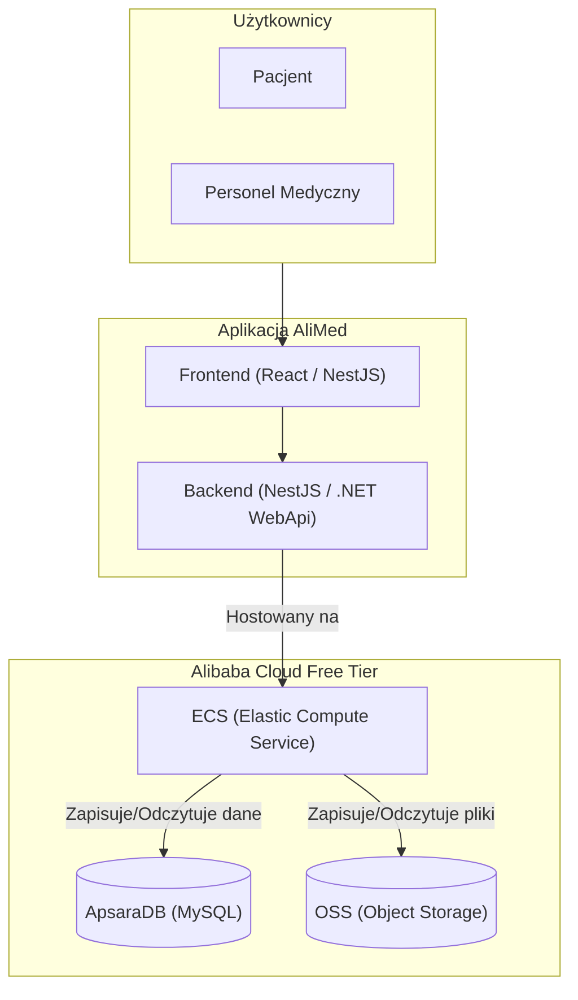

# 🏥 AliMed - Internetowy System Rejestracji Pacjentów


## 👨‍💻 Zespół (Grupa nr 3)

  * Grzegorz Matusewicz
  * Julia Łopata
  * Szymon Małota
  * Damian Litewka
  * Łukasz Antoniewicz
  * Aleksander Kutycki

-----

## 🗂️ Struktura repozytorium

```
AliMed/
├── assets/
│   └── images/
│       └── logo.png
├── LICENSE
└── README.md
```

Zasoby graficzne, w tym logo projektu, trafiają do katalogu `assets/images/` w celu łatwego odnajdywania i dalszego wykorzystania w materiałach projektowych.

-----

## � Paleta kolorów

Poniższe kolory tworzą podstawową identyfikację wizualną systemu AliMed. Stosuj je konsekwentnie w interfejsie oraz materiałach promocyjnych.

- `#1673b2` – kolor przewodni interfejsu (nagłówki, przyciski podstawowe, linki aktywne).
- `#4cb4e3` – odcień uzupełniający dla stanów hover, ikon informacyjnych i elementów akcentowych.
- `#acd045` – akcent pozytywny, używany w komunikatach sukcesu oraz elementach potwierdzających działania użytkownika.

Dbaj o kontrast z tekstem, szczególnie na jasno-niebieskich tłach, aby zachować dostępność i czytelność interfejsu.

-----

## �🎯 Opis projektu

Zespół realizuje projekt polegający na stworzeniu internetowego systemu rejestracji pacjentów z wykorzystaniem wyłącznie darmowych usług i narzędzi dostępnych w ekosystemie **Alibaba Cloud**.

System został wdrożony w środowisku testowym **Alibaba Cloud Free Tier**.

### Główne funkcjonalności

  * **Dla pacjentów:** Umożliwia zakładanie kont, umawianie wizyt, przeglądanie historii medycznej oraz zarządzanie danymi osobowymi.
  * **Dla personelu medycznego:** Umożliwia przeglądanie listy pacjentów, potwierdzanie rezerwacji i aktualizowanie terminów wizyt.

-----

## 🛠️ Architektura i Stos technologiczny

Poniższy diagram przedstawia architekturę systemu opartą o usługi Alibaba Cloud.



**Kluczowe komponenty:**

  * **Backend:** NestJS lub .NET WebApi
  * **Frontend:** React i NestJS
  * **Hosting:** Alibaba Cloud ECS (Elastic Compute Service)
  * **Baza danych:** AsparaDB for MySQL (przechowywanie danych o pacjentach, wizytach, zaleceniach)
  * **Przechowywanie plików:** Alibaba Cloud OSS (Object Storage Service) (przechowywanie dokumentów)

-----

## 🚧 Aktualne zadania (To-Do)

### Implementacja tabeli "Lekarze" w ApsaraDB for MySQL

Obecnym priorytetem jest zaprojektowanie i wdrożenie nowej tabeli w bazie danych, która będzie przechowywać szczegółowe informacje o lekarzach przyjmujących w placówce.

**Planowana struktura tabeli:**

| Nazwa kolumny | Typ danych | Opis |
| :--- | :--- | :--- |
| `imie` | `string` | Imię lekarza. |
| `nazwisko` | `string` | Nazwisko lekarza. |
| `adres_gabinetu` | `string` | Lokalizacja świadczenia usług. |
| `numer_PWZ lub PESEL` | `string/varchar` | Do wewnętrznej identyfikacji lekarza w systemie (z uwzględnieniem RODO). |
| `opis_specjalizacji` | `text` | Opis specjalizacji lub głównych obszarów praktyki (np. "Kardiolog, leczenie nadciśnienia", "Ortopeda, specjalista urazów sportowych"). |