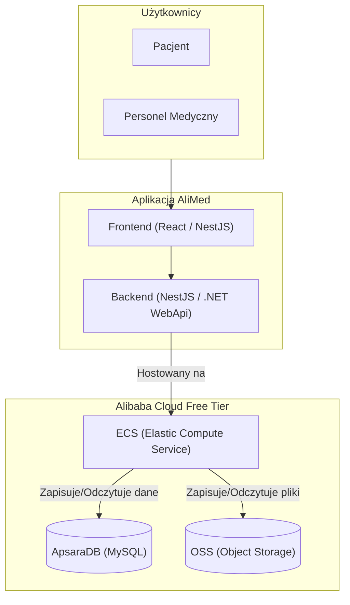

# 🏥 AliMed - Internetowy System Rejestracji Pacjentów


## 👨‍💻 Zespół (Grupa nr 3)

  * Grzegorz Matusewicz
  * Julia Łopata
  * Szymon Małota
  * Damian Litewka
  * Łukasz Antoniewicz
  * Aleksander Kutycki

-----

## 🗂️ Struktura repozytorium

```
AliMed/
├── .build/
├── .config/
├── dep/
├── doc/
│   └── brand-guidelines.md
├── res/
│   └── images/
│       ├── logo-vector-full.ai
│       ├── logo-vector-full.png
│       ├── logo-vector-full.svg
│       ├── logo-vector.svg
│       └── logo.png
├── samples/
├── src/
├── test/
├── tools/
├── LICENSE
└── README.md
```

Kod źródłowy i testy znajdują się odpowiednio w `src/` oraz `test/`. Konfiguracje lokalne umieszczamy w `.config/`, skrypty budujące w `.build/`, a zależności zewnętrzne w `dep/`. Zasoby statyczne, w tym logo projektu, trafiają do katalogu `res/` w celu łatwego odnajdywania i dalszego wykorzystania w materiałach projektowych. Przykładowe fragmenty kodu pomocniczego można umieszczać w `samples/`, a automatyzację zadań w `tools/`.

-----

## 🎨 Paleta kolorów

Poniższe kolory tworzą podstawową identyfikację wizualną systemu AliMed. Stosuj je konsekwentnie w interfejsie oraz materiałach promocyjnych.

- `#1673b2` – kolor przewodni interfejsu (nagłówki, przyciski podstawowe, linki aktywne).
- `#4cb4e3` – odcień uzupełniający dla stanów hover, ikon informacyjnych i elementów akcentowych.
- `#acd045` – akcent pozytywny, używany w komunikatach sukcesu oraz elementach potwierdzających działania użytkownika.

Dbaj o kontrast z tekstem, szczególnie na jasno-niebieskich tłach, aby zachować dostępność i czytelność interfejsu.

-----

## ✒️ Typografia i logotyp

- Logo wykorzystuje krój Lunchtype24 autorstwa Stefana Wetterstranda.
- Lunchtype24 jest objęty licencją SIL Open Font License (OFL) w wersji 1.1.
- Szczegóły licencyjne oraz wytyczne dotyczące wykorzystania logo znajdują się w `doc/brand-guidelines.md` oraz `LICENSE`.

-----

## 📚 Dodatkowa dokumentacja

- `doc/brand-guidelines.md` — rozszerzone wytyczne identyfikacji wizualnej (logo, kolory, typografia).
- `LICENSE` — zestawienie licencji projektu i zasobów zewnętrznych (w tym Lunchtype24).

-----

## 🎯 Opis projektu

Zespół realizuje projekt polegający na stworzeniu internetowego systemu rejestracji pacjentów z wykorzystaniem wyłącznie darmowych usług i narzędzi dostępnych w ekosystemie **Alibaba Cloud**.

System został wdrożony w środowisku testowym **Alibaba Cloud Free Tier**.

### Główne funkcjonalności

  * **Dla pacjentów:** Umożliwia zakładanie kont, umawianie wizyt, przeglądanie historii medycznej oraz zarządzanie danymi osobowymi.
  * **Dla personelu medycznego:** Umożliwia przeglądanie listy pacjentów, potwierdzanie rezerwacji i aktualizowanie terminów wizyt.

-----

## 🛠️ Architektura i Stos technologiczny

Poniższy diagram przedstawia architekturę systemu opartą o usługi Alibaba Cloud.



**Kluczowe komponenty:**

  * **Backend:** NestJS lub .NET WebApi
  * **Frontend:** React i NestJS
  * **Hosting:** Alibaba Cloud ECS (Elastic Compute Service)
  * **Baza danych:** AsparaDB for MySQL (przechowywanie danych o pacjentach, wizytach, zaleceniach)
  * **Przechowywanie plików:** Alibaba Cloud OSS (Object Storage Service) (przechowywanie dokumentów)

-----

## 🚧 Aktualne zadania (To-Do)

### Implementacja tabeli "Lekarze" w ApsaraDB for MySQL

## 🚀 Production Deployment

Aplikacja jest wdrożona na serwerze produkcyjnym:

- **Frontend**: http://130.162.222.70
- **API**: http://130.162.222.70/api/
- **Swagger**: http://130.162.222.70:5056/swagger

Szczegóły wdrożenia i instrukcje znajdują się w [deploy/DEPLOYMENT.md](deploy/DEPLOYMENT.md).

### Quick Deploy

```powershell
cd deploy
.\deploy-windows.ps1
```

Więcej informacji: [deploy/README.md](deploy/README.md)