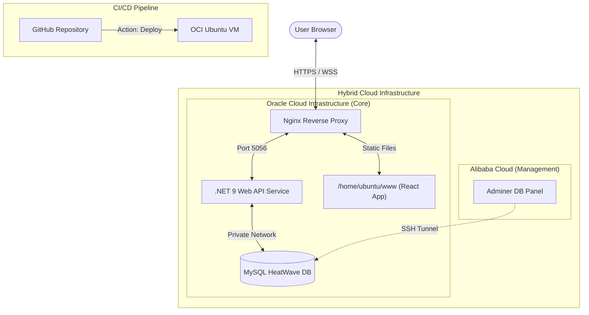

# 🏥 AliMed - Internetowy System Rejestracji Pacjentów


## 👨‍💻 Zespół (Grupa nr 3)

  * Grzegorz Matusewicz
  * Julia Łopata
  * Szymon Małota
  * Damian Litewka
  * Łukasz Antoniewicz
  * Aleksander Kutycki

-----

## 🗂️ Struktura repozytorium

```
AliMed/
├── WebAPI/              # Backend .NET 9.0
├── deploy/              # Skrypty i konfiguracje wdrożeniowe
├── doc/                 # Dokumentacja projektu
├── res/                 # Zasoby statyczne (logo, grafiki)
├── src/                 # Kod źródłowy (Frontend React)
├── test/                # Testy (E2E, SQL)
├── LICENSE
└── README.md
```

Kod źródłowy podzielony jest na `WebAPI/` (Backend) oraz `src/` (Frontend React). Wszystkie skrypty i pliki konfiguracyjne niezbędne do wdrożenia na serwerze znajdują się w `deploy/`. Zasoby statyczne, w tym logo projektu, trafiają do katalogu `res/`. Dokumentacja techniczna i wytyczne marki znajdują się w `doc/`.

-----

## 🎨 Paleta kolorów

Poniższe kolory tworzą podstawową identyfikację wizualną systemu AliMed. Stosuj je konsekwentnie w interfejsie oraz materiałach promocyjnych.

- `#1673b2` – kolor przewodni interfejsu (nagłówki, przyciski podstawowe, linki aktywne).
- `#4cb4e3` – odcień uzupełniający dla stanów hover, ikon informacyjnych i elementów akcentowych.
- `#acd045` – akcent pozytywny, używany w komunikatach sukcesu oraz elementach potwierdzających działania użytkownika.

Dbaj o kontrast z tekstem, szczególnie na jasno-niebieskich tłach, aby zachować dostępność i czytelność interfejsu.

-----

## ✒️ Typografia i logotyp

- Logo wykorzystuje krój Lunchtype24 autorstwa Stefana Wetterstranda.
- Lunchtype24 jest objęty licencją SIL Open Font License (OFL) w wersji 1.1.
- Szczegóły licencyjne oraz wytyczne dotyczące wykorzystania logo znajdują się w `doc/brand-guidelines.md` oraz `LICENSE`.

-----

## 📚 Dodatkowa dokumentacja

- `doc/brand-guidelines.md` — rozszerzone wytyczne identyfikacji wizualnej (logo, kolory, typografia).
- `LICENSE` — zestawienie licencji projektu i zasobów zewnętrznych (w tym Lunchtype24).

-----

## 🎯 Opis projektu

Zespół realizuje projekt polegający na stworzeniu internetowego systemu rejestracji pacjentów z wykorzystaniem wyłącznie darmowych usług i narzędzi chmurowych.

System został wdrożony w środowisku produkcyjnym **Oracle Cloud Infrastructure (OCI) Always Free Tier**.

### Główne funkcjonalności

  * **Dla pacjentów:** Umożliwia zakładanie kont, umawianie wizyt, przeglądanie historii medycznej oraz zarządzanie danymi osobowymi.
  * **Dla personelu medycznego:** Umożliwia przeglądanie listy pacjentów, potwierdzanie rezerwacji i aktualizowanie terminów wizyt.

-----

## 🏗️ Architektura Systemu

AliMed to nowoczesna platforma medyczna zbudowana w architekturze klient-serwer, w pełni zoptymalizowana pod środowisko chmurowe **Oracle Cloud Infrastructure (OCI)**.



---

## 💻 Stos Technologiczny

### 🔹 Frontend
- **Framework**: [React 19](https://react.dev/) + [Vite](https://vitejs.dev/)
- **Język**: TypeScript
- **Stylizacja**: TailwindCSS
- **Ikony/UI**: @heroicons/react + Headless UI
- **Internacjonalizacja**: i18next (obsługa PL/EN)
- **Komunikacja**: Axios z interceptorami dla JWT

### 🔹 Backend
- **Framework**: [.NET 9.0 Web API](https://dotnet.microsoft.com/en-us/apps/aspnet/apis)
- **ORM**: Entity Framework Core (Pomelo MySQL)
- **Bezpieczeństwo**: JWT Bearer Authentication + GitHub OAuth 2.0
- **Logika**: Serwisy domenowe, DTOs, Custom Middleware
- **Haszowanie**: PBKDF2 (Password-Based Key Derivation Function 2)

### 🔹 Infrastruktura & Baza Danych
- **Serwer**: OCI VM.Standard.E2.1.Micro (Ubuntu 24.04.3 LTS)
- **Baza Danych**: **MySQL HeatWave 9.5.2** (Managed instance w OCI)
- **Web Server**: Nginx (SSL via Certbot/Let's Encrypt)
- **Process Manager**: Systemd (zarządzanie usługą API)

---

## 🚀 CI/CD & Deployment

Projekt wykorzystuje **GitHub Actions** do pełnej automatyzacji procesów budowania i wdrażania:

1.  **Frontend Pipeline** (`frontend.yml`):
    - Automatyczne budowanie przy każdym pushu do gałęzi `main`.
    - Synchronizacja zoptymalizowanych plików `dist/` przez `rsync` do `/home/ubuntu/www`.
2.  **Backend Pipeline** (`backend.yml`):
    - Kompilacja i publikacja paczki `.dotnet publish`.
    - Deploy na VM i restart usługi `alimed-api` przez SSH.
3.  **Deploy Orchestration** (`deploy.yml`):
    - Zarządzanie sekretami i kluczami SSL w środowisku produkcyjnym.

> **Note**: Zastosowano strategię **Build Offloading**. Ze względu na ograniczone zasoby maszyny produkcyjnej (ok. 1GB RAM), procesy budowania (`dotnet build`, `npm run build`) są realizowane na runnerach GitHub Actions, a na serwer trafiają gotowe artefakty.

---

## 🛠️ Instrukcja Deweloperska

### Wymagania
- Node.js 20+
- .NET 9.0 SDK
- MySQL 9.0+ lub dostęp do VPN/OCI

### Szybki start (Local)

1.  **Repozytorium**: `git clone https://github.com/WSB-University-Problem-Based-Learning/AliMed.git`
2.  **Konfiguracja**:
    - Uzupełnij `WebAPI/API.Alimed/appsettings.Development.json` danymi bazy.
    - Uzupełnij `src/frontend/AliMed.Web/.env` adresem lokalnego API.
3.  **Uruchomienie**:
    - Backend: `dotnet run --project WebAPI/API.Alimed`
    - Frontend: `npm install && npm run dev` (w `src/frontend/AliMed.Web`)

---

## 📊 Monitoring i Administracja

- **Dashboard Produkcyjny**: [alimed.com.pl](https://alimed.com.pl)
- **Dokumentacja API (Swagger)**: [alimed.com.pl/api/swagger](https://alimed.com.pl/api/swagger)
- **Schemat Bazy Danych**: [doc/database-schema.html](doc/database-schema.html)
- **Przewodnik Wdrożeniowy**: [deploy/DEPLOYMENT.md](deploy/DEPLOYMENT.md)
- **Tablica Kanban**: [GitHub Projects](https://github.com/orgs/WSB-University-Problem-Based-Learning/projects/1)

---

## 🚀 Production Links

- **Main URL**: [https://alimed.com.pl](https://alimed.com.pl)
- **Production API**: [https://alimed.com.pl/api/](https://alimed.com.pl/api/)
- **Health Check**: `sudo systemctl status alimed-api`

---
*Grupowy projekt AliMed - 2026*