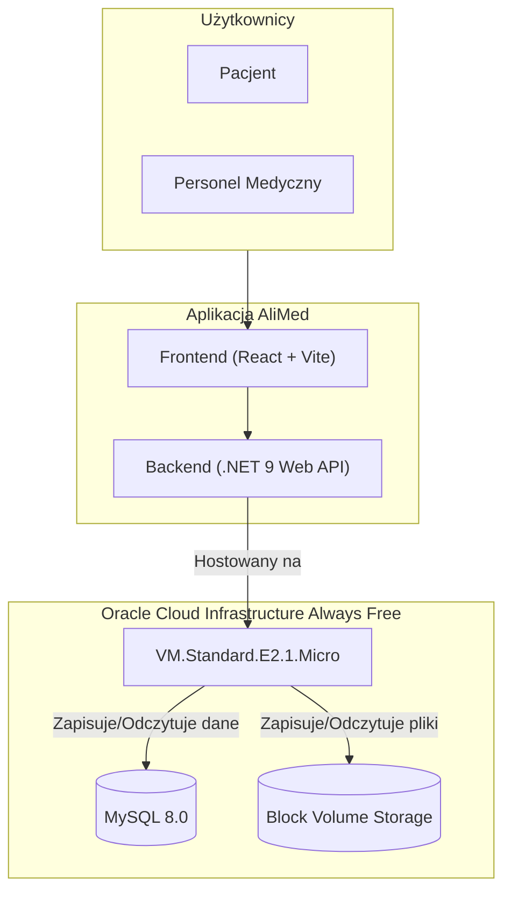

# 🏥 AliMed - Internetowy System Rejestracji Pacjentów


## 👨‍💻 Zespół (Grupa nr 3)

  * Grzegorz Matusewicz
  * Julia Łopata
  * Szymon Małota
  * Damian Litewka
  * Łukasz Antoniewicz
  * Aleksander Kutycki

-----

## 🗂️ Struktura repozytorium

```
AliMed/
├── .build/
├── .config/
├── dep/
├── doc/
│   └── brand-guidelines.md
├── res/
│   └── images/
│       ├── logo-vector-full.ai
│       ├── logo-vector-full.png
│       ├── logo-vector-full.svg
│       ├── logo-vector.svg
│       └── logo.png
├── samples/
├── src/
├── test/
├── tools/
├── LICENSE
└── README.md
```

Kod źródłowy i testy znajdują się odpowiednio w `src/` oraz `test/`. Konfiguracje lokalne umieszczamy w `.config/`, skrypty budujące w `.build/`, a zależności zewnętrzne w `dep/`. Zasoby statyczne, w tym logo projektu, trafiają do katalogu `res/` w celu łatwego odnajdywania i dalszego wykorzystania w materiałach projektowych. Przykładowe fragmenty kodu pomocniczego można umieszczać w `samples/`, a automatyzację zadań w `tools/`.

-----

## 🎨 Paleta kolorów

Poniższe kolory tworzą podstawową identyfikację wizualną systemu AliMed. Stosuj je konsekwentnie w interfejsie oraz materiałach promocyjnych.

- `#1673b2` – kolor przewodni interfejsu (nagłówki, przyciski podstawowe, linki aktywne).
- `#4cb4e3` – odcień uzupełniający dla stanów hover, ikon informacyjnych i elementów akcentowych.
- `#acd045` – akcent pozytywny, używany w komunikatach sukcesu oraz elementach potwierdzających działania użytkownika.

Dbaj o kontrast z tekstem, szczególnie na jasno-niebieskich tłach, aby zachować dostępność i czytelność interfejsu.

-----

## ✒️ Typografia i logotyp

- Logo wykorzystuje krój Lunchtype24 autorstwa Stefana Wetterstranda.
- Lunchtype24 jest objęty licencją SIL Open Font License (OFL) w wersji 1.1.
- Szczegóły licencyjne oraz wytyczne dotyczące wykorzystania logo znajdują się w `doc/brand-guidelines.md` oraz `LICENSE`.

-----

## 📚 Dodatkowa dokumentacja

- `doc/brand-guidelines.md` — rozszerzone wytyczne identyfikacji wizualnej (logo, kolory, typografia).
- `LICENSE` — zestawienie licencji projektu i zasobów zewnętrznych (w tym Lunchtype24).

-----

## 🎯 Opis projektu

Zespół realizuje projekt polegający na stworzeniu internetowego systemu rejestracji pacjentów z wykorzystaniem wyłącznie darmowych usług i narzędzi chmurowych.

System został wdrożony w środowisku produkcyjnym **Oracle Cloud Infrastructure (OCI) Always Free Tier**.

### Główne funkcjonalności

  * **Dla pacjentów:** Umożliwia zakładanie kont, umawianie wizyt, przeglądanie historii medycznej oraz zarządzanie danymi osobowymi.
  * **Dla personelu medycznego:** Umożliwia przeglądanie listy pacjentów, potwierdzanie rezerwacji i aktualizowanie terminów wizyt.

-----

## 🛠️ Architektura i Stos technologiczny

Poniższy diagram przedstawia architekturę systemu opartą o usługi Oracle Cloud Infrastructure.



**Kluczowe komponenty:**

  * **Backend:** .NET 9.0 Web API z Entity Framework Core
  * **Frontend:** React 19 + Vite + TypeScript + TailwindCSS
  * **Hosting:** Oracle Cloud Infrastructure VM (Ubuntu 24.04 LTS, 2 vCPU, 1GB RAM)
  * **Baza danych:** MySQL 8.0 (przechowywanie danych o pacjentach, wizytach, zaleceniach)
  * **Przechowywanie plików:** Block Volume Storage (45GB SSD)
  * **Autentykacja:** JWT + GitHub OAuth
  * **Domena:** alimed.com.pl (HTTPS via nginx)

-----

## � Szybki start
> 📘 **Szczegółowy przewodnik:** Sprawdź [QUICKSTART.md](doc/QUICKSTART.md) dla pełnych instrukcji uruchomienia projektu!
### Wymagania wstępne

- **Node.js** 20+ i npm
- **.NET 9.0 SDK**
- **MySQL 8.0+** lub Docker
- **Git**

### Uruchomienie lokalne

#### 1. Backend (.NET Web API)

```bash
# Przejdź do katalogu backendu
cd WebAPI/API.Alimed

# Przywróć zależności
dotnet restore

# Skonfiguruj connection string (utwórz appsettings.Development.json)
# Skopiuj appsettings.json i zmień Pwd na swoje hasło MySQL

# Uruchom migracje (jeśli są dostępne)
dotnet ef database update

# Uruchom API
dotnet run
# API będzie dostępne na: http://localhost:5056
# Swagger: http://localhost:5056/swagger
```

#### 2. Frontend (React + Vite)

```bash
# Przejdź do katalogu frontendu
cd src/frontend/AliMed.Web

# Zainstaluj zależności
npm install

# Utwórz plik .env (skopiuj z .env.example i uzupełnij)
cp .env.example .env

# Uruchom dev server
npm run dev
# Frontend będzie dostępny na: http://localhost:5173
```

### 🔑 Konfiguracja zmiennych środowiskowych

**Backend:** Utwórz `WebAPI/API.Alimed/appsettings.Development.json`:
```json
{
  "ConnectionStrings": {
    "MySqlConnection": "Server=localhost;Port=3306;Database=alimed;Uid=root;Pwd=TwojeHaslo"
  },
  "JwtSettings": {
    "SecretKey": "TwojSuperTajnyKluczJWT",
    "Issuer": "AliMed",
    "Audience": "AliMed-Users"
  }
}
```

**Frontend:** Utwórz `src/frontend/AliMed.Web/.env`:
```env
VITE_API_BASE_URL=http://localhost:5056
VITE_GITHUB_CLIENT_ID=twoj_github_client_id
VITE_GITHUB_REDIRECT_URI=http://localhost:5173/auth/github/callback
```

-----

## 🧪 Testowanie

```bash
# Backend - uruchom testy jednostkowe
cd WebAPI/API.Alimed.Tests
dotnet test

# Frontend - uruchom linter
cd src/frontend/AliMed.Web
npm run lint
```

-----

## 📁 Struktura projektu

```
AliMed/
├── WebAPI/                      # Backend .NET 9.0
│   ├── API.Alimed/              # Główna aplikacja API
│   │   ├── Controllers/         # Kontrolery REST API
│   │   ├── Data/                # DbContext i konfiguracja EF Core
│   │   ├── DTOs/                # Data Transfer Objects
│   │   ├── Entities/            # Modele bazy danych
│   │   ├── Services/            # Logika biznesowa
│   │   └── Extensions/          # Rozszerzenia i helpery
│   └── API.Alimed.Tests/        # Testy jednostkowe i integracyjne
├── src/frontend/AliMed.Web/     # Frontend React + TypeScript
│   ├── src/
│   │   ├── components/          # Komponenty React
│   │   ├── pages/               # Strony aplikacji
│   │   ├── services/            # API client
│   │   ├── context/             # Context API (Auth, Language)
│   │   ├── locales/             # Tłumaczenia i18n
│   │   └── types/               # Definicje TypeScript
│   └── public/                  # Assety statyczne
├── doc/                         # Dokumentacja projektu
├── res/                         # Zasoby (logo, grafiki)
└── test/                        # Dodatkowe testy
```

-----

## 🚧 Status projektu

### ✅ Ukończone

- ✅ System autentykacji JWT + GitHub OAuth
- ✅ Endpointy CRUD dla Pacjentów, Lekarzy, Wizyt
- ✅ Panel pacjenta z zarządzaniem wizytami
- ✅ Panel lekarza z listą pacjentów i wizyt
- ✅ Internacjonalizacja (PL/EN)
- ✅ Responsywny design z TailwindCSS
- ✅ Testy jednostkowe backendu

### 🔄 W trakcie

- 🔄 Rozbudowa panelu lekarza
- 🔄 System dokumentów medycznych
- 🔄 Setup CI/CD pipeline

### 📋 Planowane

- 📋 Przechowywanie dokumentów medycznych w Object Storage
- 📋 System powiadomień email/SMS
- 📋 Kalendarz dostępności lekarzy
- 📋 Historia zmian w dokumentacji medycznej

-----

## 🚧 Aktualne zadania (To-Do)

### Rozbudowa funkcjonalności systemu

## 🚀 Production Deployment

Aplikacja jest wdrożona na serwerze produkcyjnym:

- **Domain**: https://alimed.com.pl
- **Frontend**: https://alimed.com.pl
- **API**: https://alimed.com.pl/api/

Szczegóły wdrożenia i instrukcje znajdują się w [deploy/DEPLOYMENT.md](deploy/DEPLOYMENT.md).

### Quick Deploy

```powershell
cd deploy
.\deploy-windows.ps1
```

Więcej informacji: [deploy/README.md](deploy/README.md)