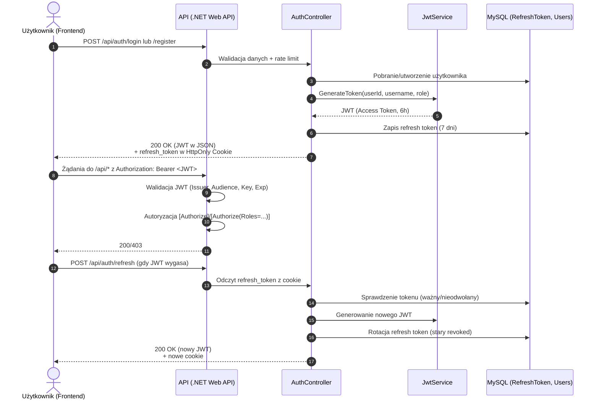

```mermaid
sequenceDiagram
    autonumber
    actor U as Użytkownik (Frontend)
    participant API as API (.NET Web API)
    participant AUTH as AuthController
    participant JWT as JwtService
    participant DB as MySQL (RefreshToken, Users)

    U->>API: POST /api/auth/login lub /register
    API->>AUTH: Walidacja danych + rate limit
    AUTH->>DB: Pobranie/utworzenie użytkownika
    AUTH->>JWT: GenerateToken(userId, username, role)
    JWT-->>AUTH: JWT (Access Token, 6h)
    AUTH->>DB: Zapis refresh token (7 dni)
    AUTH-->>U: 200 OK (JWT w JSON)<br/>+ refresh_token w HttpOnly Cookie

    U->>API: Żądania do /api/* z Authorization: Bearer <JWT>
    API->>API: Walidacja JWT (Issuer, Audience, Key, Exp)
    API->>API: Autoryzacja [Authorize]/[Authorize(Roles=...)]
    API-->>U: 200/403

    U->>API: POST /api/auth/refresh (gdy JWT wygasa)
    API->>AUTH: Odczyt refresh_token z cookie
    AUTH->>DB: Sprawdzenie tokenu (ważny/nieodwołany)
    AUTH->>JWT: Generowanie nowego JWT
    AUTH->>DB: Rotacja refresh token (stary revoked)
    AUTH-->>U: 200 OK (nowy JWT)<br/>+ nowe cookie

```